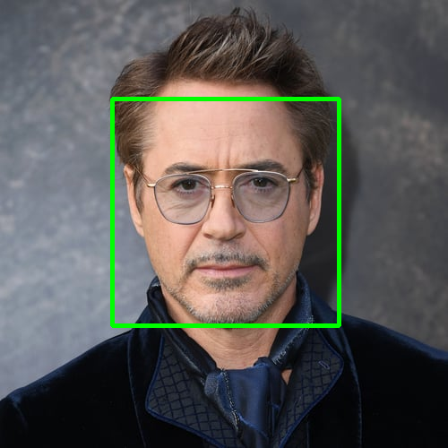

# Face_Detection with Python using OpenCV
<center>
Face detection is a computer vision technology that helps to locate/visualize human faces in digital images. This technique is a specific use case of object detection technology that deals with detecting instances of semantic objects of a certain class (such as humans, buildings or cars) in digital images and videos. With the advent of technology, face detection has gained a lot of importance especially in fields like photography, security, and marketing.
<h2> How to use the project </h2>

1. Installing the required softwares:-
    ```bash
    pip install -r requirements.txt
    ```
2. Cloning the repository:- 
    ```bash
    git clone https://github.com/mishra1683/Face_Detection.git
    ```
3. Change the directory:-
    ```bash
    cd Face_Detection
    ```
4. To close the app from the terminal, press Ctrl+C.

----
# Demonstration
  
